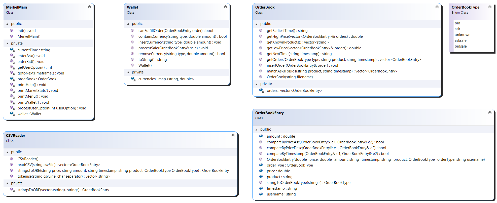

[Go back to the main page](../../../README.md)

# Table of contents

* [Object-Oriented Programming](#object-oriented-programming)
* [Topics covered](#topics-covered)
* [Assessment](#assessment)
* [Resources](#resources)
  * [Class diagram of starter code](#class-diagram-of-starter-code)
  * [Complementary learning](#complementary-learning)
    * [C&#43;&#43;](#c)
  * [On REPL](#on-repl)
  * [Notes](#notes)
  * [Syllabus](#syllabus)
* [IDE warning](#ide-warning)

---

# Object-Oriented Programming

This module will provide you with an object-oriented programming
skillset. You'll learn what objects and classes are and how to
write classes. You'll see how objects can interact with each
other, including defining and implementing interfaces to control
the interaction. You'll learn how to use inheritance to extend
functionality from parent classes. You'll learn how to write
code according to style guidelines and how to write formal code
documentation.

# Topics covered

* Variable and types
* Control flow: conditionals and iteration
* Functions
* Objects and classes
* Interaction between objects
* Inheritance: extending a parent class
* Inheritance: defining a class hierarchy
* Code documentation and style
* Abstraction and polymorphism: implementing an abstract class
* Abstraction and polymorphism: defining an interface

# Assessment

Coursework only (Type II)

# Resources

* :star: [Sourcetrail](https://www.sourcetrail.com) (Windows, macOS, Linux) - _"Free and open-source cross-platform source explorer"_. Supports C, C++, Java and Python.

## Class diagram of starter code

## Complementary learning

* [Binary Data Representation](http://web.cecs.pdx.edu/~harry/videos-binary/) - Prof. Harry H. Porter III, Ph.D., Portland State University.

### C&#43;&#43;
  * [C++](https://www.youtube.com/playlist?list=PLlrATfBNZ98dudnM48yfGUldqGD0S4FFb) - Playlist by The Cherno

## On REPL

* [YouTube](../../../youtube/README.md).
  * [C++](../../../youtube/README.md#c-2).

## Notes

* [student_notes/alex_f/notes.md](../../../notes/level_5/object-oriented-programming/student_notes/alex_f/notes.md)
* [student_notes/felipe_balbi/notes.pdf](../../../notes/level_5/object-oriented-programming/student_notes/felipe_balbi/notes.pdf)

## Syllabus

* [Syllabus PDF (April 2020)](./OOP-Syllabus.pdf)

# IDE warning

The programme's director said that "_you cannot do the work in the second half of the course in Windows with VSCode, so people would need to install Visual Studio eventually anyway._"
